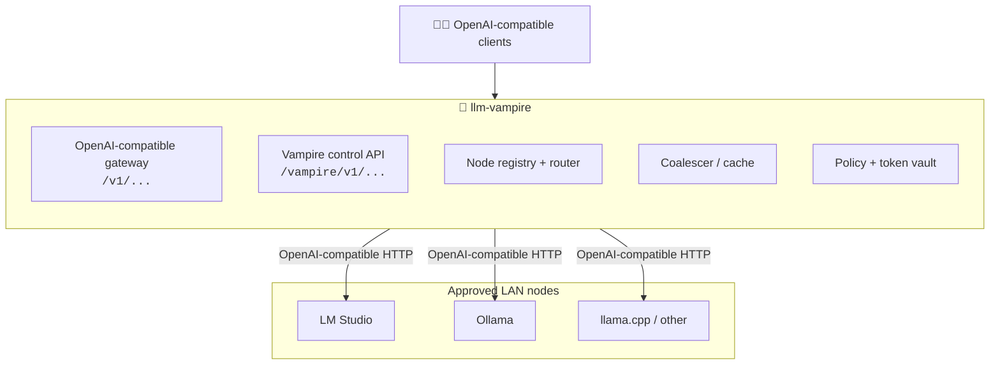

# LLM Vampire

_Local LLM Aggregator and Maximizer_

<p align="center">
  <picture>
    
  </picture>
</p>

> [!WARNING]
> This is pre-alpha. It is not yet conformant or safe for real execution.

> One governed, OpenAI-compatible endpoint for the local LLM services you trust.

**`llm-vampire`** discovers, normalizes, and combines owner-approved local LLM
services. It currently recognizes LM Studio, Ollama, llama.cpp, vLLM, LocalAI,
Jan, GPT4All, KoboldCpp, text-generation-webui, and other OpenAI-compatible
servers.

Vampire does not discover or control GPUs directly. It connects only to API
servers an owner has deliberately exposed, interrogates their model inventories,
and routes approved requests through one stable `/v1` gateway.

Each service owner stays in control of its bind address, port, authentication,
available models, and model lifecycle. Vampire can only use what that provider
offers.

The Python package is named `llm-vampire`. Existing `vampire` commands, Python
imports, environment variables, and `/vampire/v1/*` routes remain stable for
backward compatibility.

[](https://opensource.org/licenses/MIT)


[](https://www.japer.technology)

> [!IMPORTANT]
> This repository now contains build steps **Phase 0 — scaffolding** through
> **Phase 4 — browser dashboard** from
> [IMPLEMENTATION-PLAN.md](IMPLEMENTATION-PLAN.md): the transparent proxy, node
> registry with static/local-network discovery, virtual-model routing, and the
> dashboard SPA all run today. The broader orchestration system is still
> pre-alpha: request coalescing/cache, auth/policy, and advanced fusion modes
> remain future phases. See [Project status](#project-status) for what works
> today.

---

## Table of contents

- [Supported providers](#supported-providers)
- [About LM Studio](#about-lm-studio)
- [LM Studio setup](#lm-studio-setup)
- [Why](#why)
- [Features](#features)
- [How it works](#how-it-works)
- [Project status](#project-status)
- [Intended usage](#intended-usage)
- [Documentation](#documentation)
- [Construction methods](#construction-methods)
- [Roadmap](#roadmap)
- [Contributing](#contributing)
- [License](#license)
- [Acknowledgements](#acknowledgements)

Build, native packaging, checksum, and release instructions are maintained in
[`BUILDING.md`](BUILDING.md).

---

## Supported providers

LLM Vampire probes both the standard OpenAI-compatible inventory endpoint and
provider-native inventory endpoints when necessary:

| Provider family | Inventory API | Common discovery port |
| --- | --- | --- |
| LM Studio | `/v1/models`, `/api/v0/models`, `/api/v1/models` | `1234` |
| Ollama | `/api/tags`, `/v1/models` | `11434` |
| llama.cpp / LocalAI | `/v1/models` | `8080` |
| vLLM | `/v1/models` | `8000` |
| text-generation-webui | `/v1/models` | `5000` |
| GPT4All | `/v1/models` | `4891` |
| KoboldCpp | `/v1/models` | `5001` |
| Jan | `/v1/models` | `1337` |
| Other OpenAI-compatible services | `/v1/models` | configurable |

Ports are hints, not restrictions. Manual registration accepts any HTTP(S) base
URL, and local discovery ports can be overridden. Provider responses are
normalized into one inventory while retaining provider-specific metadata.

## About LM Studio

[LM Studio](https://lmstudio.ai/) is one of LLM Vampire's supported providers.
Its OpenAI-compatible and native REST APIs expose a particularly rich model
inventory, including loaded instances, context limits, runtime details, and
capabilities.

This section is a high-level introduction. The [`lmstudio.ai/`](lmstudio.ai/) folder holds a
deep, mechanism-by-mechanism technical reference sourced from LM Studio's official
[documentation](https://lmstudio.ai/docs).

### What LM Studio is

LM Studio is a desktop application and developer platform for downloading and running
open-weight LLMs **locally** — entirely on hardware the owner controls. It runs **GGUF**
models through the llama.cpp engine on Mac, Windows, and Linux (CPU and GPU via CUDA,
Vulkan, Metal, or ROCm), and **MLX** models through the MLX engine on Apple Silicon.
Inference runtimes are versioned and managed independently of the app, and the engine
supports modern features such as flash attention, KV-cache GPU offload, MoE expert
configuration, and continuous batching.

Crucially for Vampire, LM Studio is not a single binary but a **family of components**,
any of which can stand behind an API endpoint:

| Component | What it is |
| --- | --- |
| **LM Studio (desktop app)** | The GUI app for Mac/Windows/Linux, with a Developer tab that runs the local API server. The most common node type — the owner toggles the server on or off in the GUI. |
| **llmster** | The core of LM Studio packaged as a standalone, server-native daemon with no GUI (LM Studio 0.4.0+). Ideal for headless Linux boxes, cloud servers, and GPU rigs. |
| **`lms` CLI** | The MIT-licensed command-line utility ([lmstudio-ai/lms](https://github.com/lmstudio-ai/lms)) that ships with LM Studio for scripting node behavior: starting the server, loading models, and managing links. |
| **lmstudio-python / lmstudio-js** | Official SDKs ([lmstudio-ai/lmstudio-python](https://github.com/lmstudio-ai/lmstudio-python), [lmstudio-ai/lmstudio-js](https://github.com/lmstudio-ai/lmstudio-js)) speaking LM Studio's native protocol (Vampire primarily uses HTTP). |
| **LM Link** | An end-to-end-encrypted device network (built on Tailscale) that lets a node use a remote model as if it were local. |

### The local API server

When an owner turns on the server, a running LM Studio instance (default
`http://localhost:1234`) exposes several API families **on the same port**:

| Surface | Base path | Notes |
| --- | --- | --- |
| OpenAI-compatible | `/v1/*` | The drop-in surface Vampire proxies transparently. |
| Anthropic-compatible | `/v1/messages` | Anthropic-style messages endpoint. |
| Native REST v1 | `/api/v1/*` | Rich model inventory and load/unload control (LM Studio 0.4.0+). |
| Legacy REST v0 | `/api/v0/*` | Per-request stats such as tokens/sec and TTFT (LM Studio 0.3.6+). |

The OpenAI-compatible `/v1/*` surface — covering routes such as `/v1/models`,
`/v1/chat/completions`, `/v1/completions`, and `/v1/embeddings` — is what makes existing
OpenAI clients work against local models simply by changing the base URL. This is the
surface Vampire presents to clients and proxies to nodes.

### The owner stays in control

LM Studio is designed so the machine's owner decides exactly what is exposed. Through the
server settings (and the `lms` CLI) the owner controls:

- whether the server is running at all, and on which **port**;
- the **bind address** — local only, or served on the local network;
- **CORS** behavior;
- whether **API-token authentication** is required, and which tokens are valid (0.4.0+);
- **model lifecycle**: just-in-time (JIT) loading, idle TTL, and auto-evict;
- **concurrency**: how many parallel requests a node will accept via continuous batching.

Vampire respects all of these. It can only use what an LM Studio owner has chosen to
offer — which is precisely why LM Studio's permission and authentication model is central
to Vampire's governance layer.

### Rich, machine-readable model metadata

LM Studio's APIs report detailed, structured information that Vampire's inventory layer
consumes directly during interrogation, including model `format` (`gguf`/`mlx`), runtime
name and version, `quantization`, `params_string` (e.g. `"7B"`), `size_bytes`,
`architecture`, `max_context_length`, and capability flags such as `vision`,
`trained_for_tool_use`, and allowed `reasoning` effort options. This lets Vampire make
model-aware, capability-aware routing decisions across heterogeneous nodes.

### Version landmarks

LM Studio evolves quickly, and Vampire must tolerate nodes at different versions:

| LM Studio version | Capability introduced |
| --- | --- |
| 0.3.6 | REST API `/api/v0/*` with enhanced per-request stats. |
| 0.4.0 | Native REST API `/api/v1/*`, API-token authentication, the llmster daemon, `lms daemon`, and LM Link. |

A 0.3.x node offers `/v1/*` and `/api/v0/*` only, with no token authentication; a 0.4.0+
node adds `/api/v1/*`, tokens, headless llmster operation, and LM Link remote routing.

For the full treatment of each mechanism and how Vampire maps onto it, see the
[`lmstudio.ai/`](lmstudio.ai/) reference — especially
[12-vampire-integration.md](lmstudio.ai/12-vampire-integration.md).

## LM Studio setup

Before an LM Studio machine should be discovered, trusted, or routed through
Vampire, configure its server, authentication, CORS, model loading, and
prompt/response logging posture deliberately. The definitive owner checklist is:

**[LMSTUDIO-SETUP.md](LMSTUDIO-SETUP.md)**

It covers desktop and headless setup, LAN exposure, API tokens, scanner
verification, and the privacy controls needed for other Vampires to trust that
prompt/response and verbose server logging have been minimised.

## Why

AI compute is already widely distributed. Millions of homes, offices, studios, labs,
classrooms, and gaming rooms contain GPUs that sit idle for much of the day, and many
can already run useful local models. The missing layer is not model execution — local
LLM runtimes provide that — but **discovery, permission, routing, policy, and
coordination**.

`llm-vampire` asks: *what useful AI work can be served first by compute we already
own, already trust, and already have nearby?*

- **Families** turn a home gaming PC into a shared, private AI appliance.
- **Small businesses** reuse workstation capacity before renting more cloud compute.
- **Classrooms and events** become AI-capable with one strong host.
- **Developers** get a stable local endpoint that load-balances across machines.

## Features

- 🧛 **Discovery** — probes common local-provider ports for approved endpoints.
- 🔄 **Provider normalization** — presents OpenAI-compatible and native Ollama
  inventories in one consistent model catalog.
- 🔌 **Drop-in compatibility** — exposes a stable OpenAI-compatible API; existing clients
  only change their base URL.
- 🧭 **Smart routing** — model-aware and load-aware routing, with failover across nodes.
- 🤝 **Request coalescing** — collapses concurrent identical prompts into one inference.
- ⚡ **Caching** — serves repeated requests from an exact result cache.
- 🧩 **Fusion modes** — parallel, race, and judge/refiner strategies across machines.
- 🔐 **Owner control** — respects tokens, realms, and policy before routing any request.
- 🏠 **Local-first & private** — prompts stay on trusted, nearby compute.

## How it works

`llm-vampire` sits in front of one or more local LLM nodes as a transparent proxy
and adds opt-in orchestration:



- **Compatibility first.** Routes such as `/v1/models`, `/v1/chat/completions`,
  `/v1/completions`, and `/v1/embeddings` follow the OpenAI-compatible API.
- **Vampire additions are opt-in.** Advanced behavior is enabled through an extra
  `vampire` request field, `X-Vampire-*` headers, or dedicated `/vampire/v1/...` routes,
  so existing clients keep working unchanged.

See [DESIGN-API.md](DESIGN-API.md) for the full API specification.

## Project status

This project is in an **early runnable scaffold** state. The design papers still define
the product direction, but the first five METHOD-A build steps (Phases 0–4) are now
represented in code and exercised by the test suite:

| IMPLEMENTATION-PLAN.md phase | Current state |
| --- | --- |
| **Phase 0 — Scaffolding & foundations** | Implemented: installable Python package, `vampire` console script, FastAPI app factory, settings with `VAMPIRE_*` overrides, core Pydantic models, browser UI, pytest coverage, Ruff formatting/linting, mypy strict mode, and CI-oriented validation commands. |
| **Phase 1 — Transparent proxy** | Implemented: `/v1/models`, `/v1/chat/completions`, `/v1/completions`, `/v1/embeddings`, `/v1/responses`, and a compatibility catch-all forward to one configured local LLM node while preserving query strings, end-to-end headers, JSON responses, streaming responses, and OpenAI-style error envelopes for unreachable upstream nodes. |
| **Phase 2 — Node registry + discovery** | Implemented: in-memory node registry CRUD including `PATCH`/`DELETE`, manual registration, OpenAI-compatible and Ollama model interrogation, CLI node draining/restoration, static/local multi-port discovery, registered-node aggregation for `/v1/models` and `/vampire/v1/models`, and basic per-node metrics. |
| **Phase 3 — Routing** | Implemented: virtual models (`vampire:auto`, configured routes), the MVP router strategies (`round_robin`, `least_busy`, `least_latency`, `model_affinity`, `trusted_only`) with `fallback`, `GET/POST/DELETE /vampire/v1/routes`, opt-in routing via the `vampire` request object and `X-Vampire-*` headers, and `X-Vampire-*` response metadata. |
| **Phase 4 — Browser dashboard** | Implemented: a static SPA served from `/` that drives the control API for status, nodes, discovery, models, routes, metrics, and owner share mode, plus a prompt playground that calls `/v1/chat/completions`; the `vampire dashboard` / `vampire ui` command prints or opens the dashboard URL. |
| **Phase 5+** | Planned: cache/coalescing, auth/policy/token vault, and advanced fusion modes. |

The project is **not affiliated with LM Studio** unless explicitly adopted by that team.
Track and shape the direction through the documents below and the repository's issues
and pull requests.

## Intended usage

> The local development path below works for the current Phase 0–4 scaffold
> (proxy, registry, discovery, routing, and dashboard). The single-command
> installers remain planned future deliverables.

#### Most desired installation path

The headline goal is a **single-command install** that works anywhere with no
prerequisites — ideal for deploying on Linux boxes, cloud servers, or even in CI.
These installers are still planned:

**macOS / Linux**

```bash
curl -fsSL https://github.com/japer-technology/llm-vampire/install.sh | bash
```

**Windows (PowerShell)**

```powershell
irm https://github.com/japer-technology/llm-vampire/install.ps1 | iex
```

This downloads and sets up `vampire` directly, with no `pip`, interpreter, or
manual build step required.

#### Alternative: install via pip

For Python environments, install the current scaffold from a checkout:

```bash
pip install -e ".[dev]"
```

#### Run the gateway

Start at least one local LLM service, then run:

```bash
vampire serve
```

The gateway listens on:

```text
http://localhost:7777/v1
```

Point any OpenAI-compatible client at that base URL instead of a single provider.
Use the dashboard or `vampire discover local` to find services. With no nodes
registered, Vampire forwards requests to its configured fallback node. Override it
with:

```bash
VAMPIRE_DEFAULT_BASE_URL=http://llm-host:1234 vampire serve
```

The legacy `VAMPIRE_LMSTUDIO_BASE_URL` setting remains accepted.

The same process serves the Phase 4 browser dashboard at `http://localhost:7777/`.
Open it directly or print/open the URL with:

```bash
vampire dashboard
vampire ui --open
```

The dashboard shows nodes, models, health, routes, metrics, owner share mode, and
a prompt playground that calls the gateway's `/v1/chat/completions` endpoint.

POSSIBILITIES.md calls out manual node draining as the next command-level node
management surface. Drain a registered node out of routing, then restore it after
maintenance, with:

```bash
vampire nodes drain home-gpu
vampire nodes drain home-gpu off
```

For development validation, run the same checks used by the Phase 0 scaffold:

```bash
ruff format --check .
ruff check .
mypy
pytest
```

## Documentation

| Document | What it covers |
| --- | --- |
| [VISION.md](VISION.md) | One-paragraph vision for the project. |
| [ASPIRATION.md](ASPIRATION.md) | The full aspirations paper: thesis, audiences, and goals. |
| [LMSTUDIO-SETUP.md](LMSTUDIO-SETUP.md) | Definitive LM Studio owner setup: server, auth, LAN/CORS, model loading, scanner verification, and logging/privacy posture. |
| [DESIGN-API.md](DESIGN-API.md) | The OpenAI-compatible + Vampire orchestration API design. |
| [docs/analysis/MVP.md](docs/analysis/MVP.md) | Minimum Viable Product definition. |
| [docs/analysis/MVVP.md](docs/analysis/MVVP.md) | Minimum Viable Valuable Product (per Guy Kawasaki). |
| [docs/analysis/MVVVP.md](docs/analysis/MVVVP.md) | Minimum Viable Valuable Validating Product (per Guy Kawasaki). |
| [POSSIBILITIES.md](POSSIBILITIES.md) | Broader explorations and feature possibilities. |
| [docs/vampire.md](docs/vampire.md) | The consent & contribution design thesis, in the project's vampire/folklore register. |
| [docs/startrek.md](docs/startrek.md) | The same thesis retold in a Star Trek register. |
| [docs/security-design-thesis.md](docs/security-design-thesis.md) | The rigorous, metaphor-free security treatment: consent, `vampire<NN>` tiers, metering, enforcement. |

## Construction methods

Several candidate architectures have been evaluated. Each is independently described:

| Method | Approach |
| --- | --- |
| [METHOD-A](METHOD-A.md) | Python service (FastAPI) + browser interface — **recommended starting point**. |
| [METHOD-B](METHOD-B.md) | Single compiled Go/Rust binary with embedded UI. |
| [METHOD-C](METHOD-C.md) | TypeScript full-stack (Node + shared types). |
| [METHOD-D](METHOD-D.md) | Distributed agent mesh with no central server. |
| [METHOD-E](METHOD-E.md) | Browser-first, near-serverless thin client. |

## Roadmap

The recommended build order (from [METHOD-A](METHOD-A.md)) is:

1. **Proxy** — forward `/v1/*` to a single local LLM node. ✅
2. **Registry + discovery** — manual registration and static/dev-subnet discovery
   with health checks (mDNS discovery is still planned). ✅
3. **Routing** — round-robin and failover, then model-aware and load-aware routing. ✅
4. **UI** — dashboard for nodes, models, and health, plus a prompt playground. ✅
5. **Coalescing + cache** — in-flight deduplication, then an exact result cache.
6. **Policy + tokens** — owner modes, realms, token vault, and allowlists.
7. **Fusion** — parallel, race, and judge/refiner modes via `/vampire/v1/fusion`.

Each step is intended to be independently shippable. This is the *build order*
(fastest path to a working demo); the *thematic* capability roadmap, grouped by
feature area, is in [ASPIRATION.md](ASPIRATION.md), and
[IMPLEMENTATION-PLAN.md](IMPLEMENTATION-PLAN.md) maps the two together.

## Contributing

Contributions, ideas, and design feedback are welcome. With the early build steps
(Phases 0–4) now running, the most valuable contributions right now are:

- Reviewing and refining the design documents above.
- Discussing the construction trade-offs in the method papers.
- Building out the next [roadmap](#roadmap) steps — coalescing/cache, policy/tokens,
  and fusion modes.

Please open an issue to start a discussion before submitting larger changes, and keep
pull requests focused.

## License

A license has not yet been selected for this project. Until one is added, all rights are
reserved by the authors. If you intend to use or build on this work, please open an
issue to discuss licensing.

## Acknowledgements

`llm-vampire` builds on open local-LLM API surfaces, including those provided by
[LM Studio](https://lmstudio.ai):

- [OpenAI-compatible API](https://lmstudio.ai/docs/developer/openai-compat)
- [LM Link](https://lmstudio.ai/docs/developer/core/lmlink)
- [Authentication](https://lmstudio.ai/docs/developer/core/authentication)

It is informed by LM Studio's open-source repositories under the
[`lmstudio-ai`](https://github.com/lmstudio-ai) organisation:

- [lmstudio-ai/docs](https://github.com/lmstudio-ai/docs) — official App and Developer docs (the source for the [`lmstudio.ai/`](lmstudio.ai/) reference folder)
- [lmstudio-ai/lms](https://github.com/lmstudio-ai/lms) — the `lms` CLI
- [lmstudio-ai/lmstudio-python](https://github.com/lmstudio-ai/lmstudio-python) — official Python SDK
- [lmstudio-ai/lmstudio-js](https://github.com/lmstudio-ai/lmstudio-js) — official TypeScript SDK
- [lmstudio-ai/configs](https://github.com/lmstudio-ai/configs) — JSON configuration file format and examples
- [lmstudio-ai/mlx-engine](https://github.com/lmstudio-ai/mlx-engine) — Apple MLX inference engine
